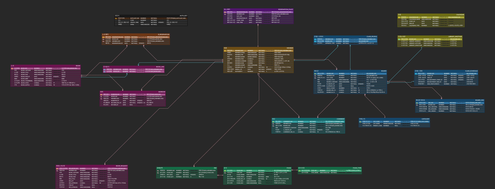

## 깊이있는 개발자가 되기 위한 스터디🔥

- 깊이있는 개발자가 될때까지 동안 진행되는 **CS & Spring boot 학습 & Spring MVC 프로젝트 리팩토링** 입니다.
- 매 주 **✔월요일 오전10:00** 까지 Jira를 통해 주어진 학습 목표를 완료하고, 광진구 1인 가구 센터에 모여서 5~6시간 동안 스터디를 진행합니다.
    - Sprint의 분량을 학습 후 정리해서 질문과 답변 형식으로 스터디를 진행합니다. 


- 개발 관련 공부를 할때는 GatherTown에 접속 후 진행합니다.
    - 이슈가 있을 시 GatherTown 회의실에서 회의를 진행합니다.
    - GatherTown을 통해 일일출석 체크를 진행합니다.

<br>
<br>

### 📚 STUDY
- 김영한의 스프링 완전 정복
- CS 베스트셀러
- Spring boot
- JPA
- Docker
- CI/CD
- linux
- AWS


### 주차별 활동 정리
- [1주차](/Recap/Week1.md)
  - 스터디의 방향성 정리
    - SpringBoot - JPA - QueryDSL - Docker - CI/CD - AWS
    - CS 관련 베스트 셀러 읽기
    - CS 공부하기
- [2주차](/Recap/Week2.md)
    - Proxy
    - DI Container
    - HTTP Protocol
- [3주차](/Recap/Week3.md)
  - 리팩터링(책)
  - JAVA - Reflection 
  - JPA 
  - Virtual machine
- [4주차](/Recap/Week4.md)
  - Thread
  - Process
  - JAVA - Thread
  - JPA
- [5주차](/Recap/Week5.md)
  - 진행 과제(5~11주차로 완료, https://github.com/gunhaa/bitlibrary)
    - SpringBoot/JPA를 통해 백엔드 구축 완료
    - Thymeleaf/Js로 프론트엔드 구축 완료 
    - Jenkins/Docker/AWS Ec2를 통한 CI/CD 구축완료
  
  
```plaintext
건하는 도서관 사업을 시작하기 위해 그림처럼 ERD를 설계하였습니다.  
하지만 해당 ERD는 JPA를 염두에 두고 제작하지 않아서 JPA를 쓰기에 적합하지 않습니다.  
해당 엔티티 관계 다이어그램을 JPA에 맞게 수정하고,  
건하의 도서관 사업을 위해 Spring Boot JPA로 Entity를 만들어주세요.

**조건**  
1. 각 테이블을 JPA에 맞게 수정해서 다시 작성해주세요.  
2. 각 테이블이 잘 만들어졌는지 확인할 수 있는 테스트 코드를 작성해주세요. (테이블 별로 확인 할 수 있도록)  
3. 고객들은 인내심이 부족해서 로딩이 늦으면 바로 페이지를 이탈합니다. 
   어플리케이션을 빠르게 하기 위해 쿼리가 최대한 적게 나가도록 설계하고, N+1 문제가 없도록 작성해주세요.  
4. 건하는 웹페이지 제작 후 사이트 홍보를 위해 할인 쿠폰 발급을 특정 시간에 할 예정입니다.  
   이때, 특정 시간(최소 1시간) 동안 TPS가 1000을 넘을 예정이니 이에 적합한 시스템 아키텍처를
    제안하고 그림으로 표현해주세요.  
   (단, 건하는 예산이 적고 서버 컴퓨터 성능도 좋지 않아서 쓰레드 풀 1000개 같은 방식을
    사용할 수 없으므로 가장 비용 효율적인 방안을 제시해주세요.)  
5. 이번 주에 다 하지 못하더라도 가능한 곳 까지 구현해주세요. 계속 진행할 예정입니다.

**추가 조건**  
6. 도서관 추천 시스템을 개발해주세요. 책의 대여 기록을 분석하여 가장 인기 있는 도서를 추천하거나,  
   특정 사용자의 대여 이력을 기반으로 맞춤형 추천 목록을 제공하는 알고리즘을 구상하고 구현해주세요.
7. 책을 이용한 여러가지 서비스를 많이 추가할 예정이라 확장 가능한 구조로 만들어주세요.
8. 건하는 앞으로 수 년간 도서관을 운영할 예정이여서 유지보수 하기 쉬운 구조를 원합니다.

** 생성 방법 **
1. 새로운 브랜치 생성 후 (Week n) 각자의 Code 폴더에 `bitlibrary${이니셜}` 로 폴더를 생성해주세요 
2. 관련 문서는 md 폴더에 `bitlibrary` 로 저장해 주세요
3. start.spring.io에서 Group : `bitcopark` , Artifact : `library` 로 만들어주세요
```


###  소스 코드 업로드
1. Main branch에서 새 branch를 생성한다.
2. 학습한 내용을 **본인의 branch**에 push한다.
3. 스터디에서 학습을 진행한 후, main에 pr한다.

<br>


### CS 관련 책 읽기(12월)


- 읽어야 할 책 : 리팩터링
- 읽은 후 기존 프로젝트 리팩토링 작업 시작

<br>


### 🔹 Code Review 요청
- 새로운 브랜치를 생성후 학습한 내용을 바탕으로 리팩토링 후 코드 리뷰를 요청한다. 
- 자유롭게 의견을 제시한다.
    - 잘했다고 생각하는 부분 칭찬하기
    - 개선이 필요한 부분 설명하기
        - 단, 개선이 필요한 이유를 충분히 설명해 주세요.
    - 궁굼한 부분 물어보기
- 코드 작성자에게 피드백하는 것이 아닌, 코드 자체를 피드백한다는 생각으로 리뷰한다.


<br>

### 🔹 Pull Request 규칙
- 스터디에서 발표한 주제를 정리한 후 PR한다.
- 스터디에서 진행한 내용의 Branch를 병합시킨다.

<br>

### 🔹 Commit Message 컨벤션

```
type : subject
```

#### ✔ Type
- **Add**: 소스 코드 파일 추가
- **Refactor**: 소스 코드 수정
- **chore** : 기타 변경 사항
- **docs**: md 내용 변경

#### ✔ Subject
- 50자 이하의 간단한 제목을 사용한다.
    > ex) Add: 홍길동 <br>
    > ex) Refactor: MemberService 리팩토링 <br>
    > ex) Style: 함수명 변경


<br>

### 🔹 Branch 컨벤션
- `본인_이름(영어_이니셜⭕)`/`숫자(n주차)`
    > ex) hgh/1 <br>
    - branch 이름에 한글이 들어가면 문제가 생겨서 반드시 본인 이름을 영어 이니셜로 branch를 생성해 주세요!
- 각 주마다 branch를 새롭게 생성해서 정리한다.
- 코드 리뷰 요청할 브랜치의 경우 `본인_이름(영어_이니셜⭕) / review${숫자}` 로 생성한다.

<br>

### 🔹 Folder 컨벤션
- `기술스택-{$강의이름}` / 특정 강의 내용 정리
- 각 주차 정리 내용은 Recap폴더 안에 `Week{n}` 으로 작성한다


<br>

### 🔹 Directory 구조 예제
```
📂 People
├── 📂Code
│   ├── 📂SpringBoot - 실전! 스프링부트1
│   │   ├── 💾Example1.java
│   │   ├── 💾Example2.java
│   │   └── 💾...
│   ├── 📂SpringBoot - 자바 ORM 표준 JPA
│   │   ├── 💾Example1.java
│   │   └── 💾...
│   ├── 📂Week1
│   │   ├── 💾Example1.java
│   │   └── 💾...
├── 📂images(README.md)
│   ├── 📷image1.jpg
│   ├── 📷image2.png
│   └── 📷...
└── 📂md
    ├── 📂SpringBoot - 실전! 스프링부트1
    │   └── 📄${topic1}.md
    │   └── 📄${topic2}.md
    └── 📄{$peopleName}.md

```

<br>
<br>

## 🔸 참여자
<table>
  <tr>
    <td align="center">
      <a href="https://github.com/gunhaa">
        <br />
        <sub><b>황건하</b></sub></a><br />
        <a href="https://github.com/gunhaa" title="Code">💻</a>
    </td>
    <td align="center">
      <a href="https://github.com/">
        
        <br />
        <sub><b>배지환</b></sub></a><br />
        <a href="https://github.com/" title="Code">💻</a>
    </td>
    <td align="center">
      <a href="https://github.com/">
        <br />
        <sub><b>이재원</b></sub></a><br />
        <a href="https://github.com/" title="Code">💻</a>
    </td>
  </tr>
</table>  
