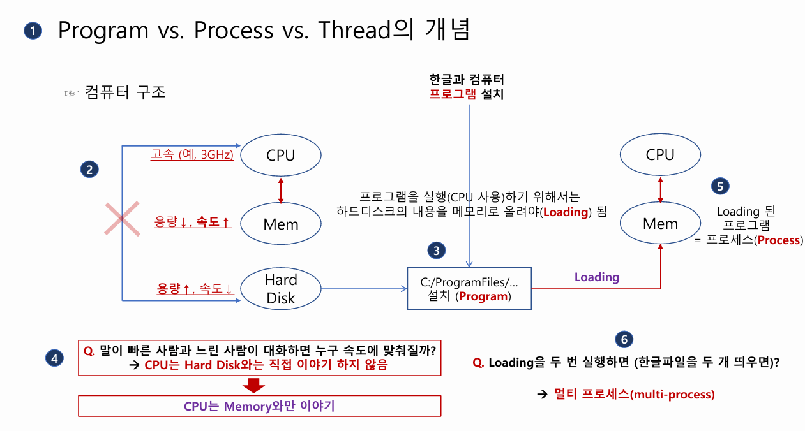
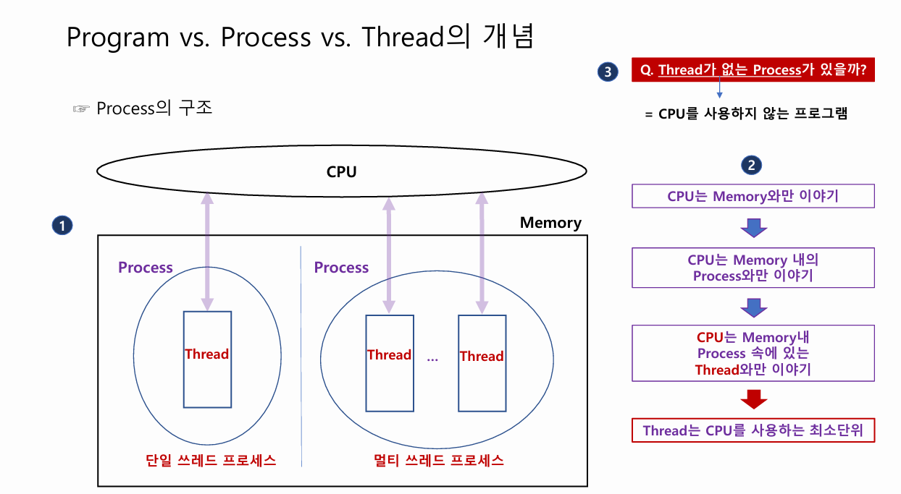
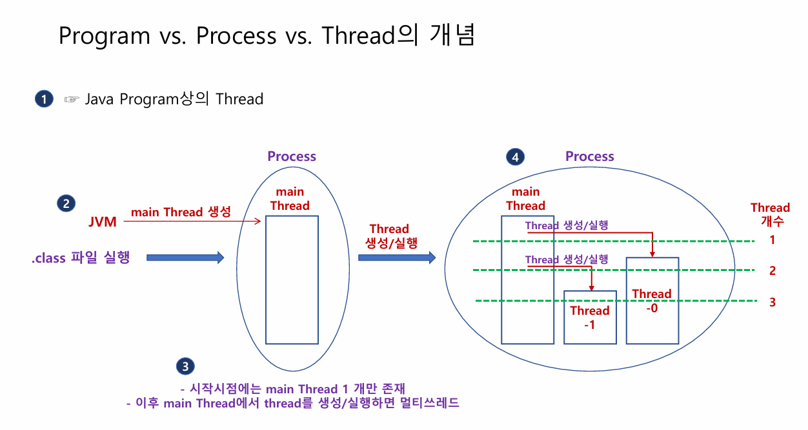

# 4주차 스터디 정리

> JAVA - Thread / JPA





## Program vs Process vs Thread

### 프로그램(Program)
> 프로그램은 디스크(저장 장치)에 저장된 실행 파일을 의미한다. 실행되지 않은 정적인 상태로, 메모리 위에서 활동하지 않는 데이터를 말한다.

- 실행 가능 상태이며, 실행될 경우 프로세스가 된다.

### 프로세스(Process)

> 프로세스는 실행 중인 프로그램을 의미한다. 운영체제에 의해 메인 메모리에 로드되어 실행 상태에 있는 단위를 말한다.

- 각 프로세스는 독립된 메모리 공간(코드, 데이터, 스택, 힙)을 가진다.
- 프로세스 간 데이터 교환은 어렵고, IPC(Inter-Process Communication) 기법이 필요하다.

### 쓰레드(Thread)
> 쓰레드는 프로세스 내에서 실행되는 작업의 최소 단위다.

- 같은 프로세스 내의 쓰레드는 코드, 데이터, 힙 메모리를 공유한다.
- 각 쓰레드는 고유한 스택과 레지스터를 가진다.
- 다수의 쓰레드로 구성된 프로세스는 병렬 처리가 가능하다.

### 차이점
- 프로그램은 정적, 프로세스는 동적
- 프로세스는 독립적인 메모리 공간을 가지며, 쓰레드는 프로세스 내부에서 자원을 공유한다.

### 프로그램을 loading 시키는 방법

- 필요한 부분을 메모리에 loading한다.
- Paging을 이용한 로딩을 한다.
    - 동적 로딩의 한 형태로, 프로그램이 실행되면서 사용되는 페이지(메모리 블록)만 로드하는 기법이다.

## Java에서의 Thread

### 구현방법

1. Thread 클래스 상속
> java.lang.Thread 클래스를 상속받아 쓰레드를 구현하는 방식이다.
- Thread 클래스를 상속받아 새로운 클래스를 생성한다.
- run() 메서드를 오버라이드하여 쓰레드의 동작을 정의한다.
- 객체를 생성한 뒤 start() 메서드를 호출하여 쓰레드를 실행한다.
- 단순한 쓰레드 동작 정의 시 사용하지만, 다른 클래스를 상속받아야 하는 경우 부적합하다.(java는 다중 상속을 지원하지 않는다.)
```java
class MyThread extends Thread {
    @Override
    public void run() {
        System.out.println("Thread 실행 중: " + Thread.currentThread().getName());
    }
}

public class Main {
    public static void main(String[] args) {
        MyThread thread = new MyThread();
        thread.start();
    }
}

```

2. Runnable 인터페이스 구현
> java.lang.Runnable 인터페이스를 구현하는 방식이다.
- Runnable 인터페이스를 구현하여 클래스 작성.
- run() 메서드를 오버라이드하여 작업을 정의한다.
- Thread 객체를 생성하면서 Runnable 구현체를 전달.
- Thread의 start() 메서드를 호출하여 실행.
- 다중 상속이 필요한 경우 선호되며, 객체 간 결합도를 낮출 수 있다.
```java
class MyRunnable implements Runnable {
    @Override
    public void run() {
        System.out.println("Runnable 실행 중: " + Thread.currentThread().getName());
    }
}

public class Main {
    public static void main(String[] args) {
        Thread thread = new Thread(new MyRunnable());
        thread.start();
    }
}
```

3. 람다 표현식 사용 (Java 8 이상)
> Runnable 인터페이스의 구현을 람다 표현식으로 간결하게 작성하는 방식이다.

- Runnable을 직접 구현하지 않고, 람다 표현식으로 run() 메서드의 구현을 전달.
- Thread 객체 생성 시 전달하여 실행.
- 작업이 간단하고 Java 8 이상을 사용할 때 간결하게 작성 가능하다.

```java
public class Main {
    public static void main(String[] args) {
        Thread thread = new Thread(() -> {
            System.out.println("Lambda로 실행 중: " + Thread.currentThread().getName());
        });
        thread.start();
    }
}
```

#### 해당 문법이 사용 가능한 이유
- 람다 표현식이 동작하는 조건: 함수형 인터페이스
- 람다 표현식은 하나의 추상 메서드만 가진 인터페이스, 즉 함수형 인터페이스에서 사용 가능하다.
```java
@FunctionalInterface
public interface Runnable {
    void run(); // 단 하나의 추상 메서드
}
```

### java의 메인메서드
- java의 메인메서드는 `main` 이라는 이름의 스레드를 생성시킨 것이다.
- 이 스레드와 같이 동작하는 다른 스레드들이 코드를 통해서 생성되는 것이다.