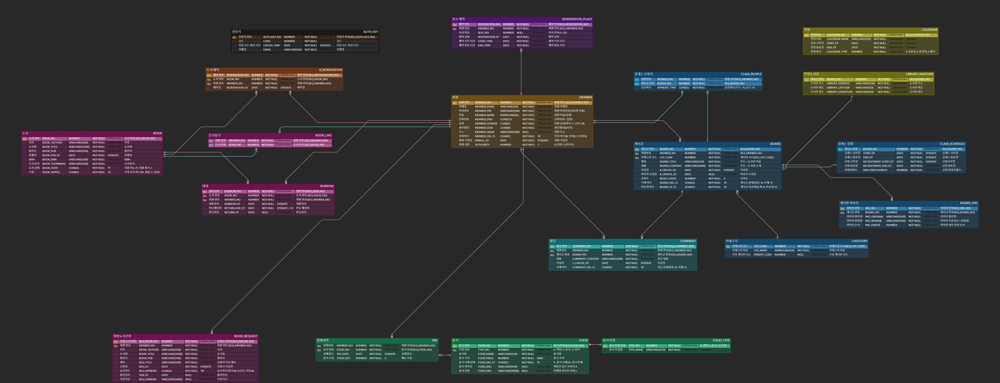

# 잘 만든 아키텍처 구조의 서버 제작

> Spring Boot, JPA, Redis, MySQL, Auth2.0

- 되게 신기한게 저 비전공 신입인 상태로 당근마켓 백엔드 채용공고중 경력 공고(토스랑 다른 스타트업도 면접 기회는 얻게 되었어요)에 합격해서 면접 보러가게 되었습니다. 근데 이분이 말씀한것처럼 구성했어요. JMeter로 부하 테스트 해서 쿼리 튜닝이나, 아키텍처 구조 개선, 캐싱등을 적용했을때 어디서 병목이 발생하고 어떻게 해결했는지 등을 썼는데 합격했습니다. 부하 테스트 규모는 500~1000TPS정도로 했었습니다. 굉장히 좋은 방법인것 같아요. 그리고 과정에 대해서 꼭 기록 해놓으시길. 2년 반정도 전에 처음 c언어로 공부 시작할 때 주로 보다가 이번에 우연히 다시 보게되었는데 신기하네요. 이 영상을 일찍 봤었으면 처음부터 이목표로 했었을것 같습니다.

- 목표는 해당 댓글처럼 JMeter를 통해 TPS 1000을 견디는 서버를 만들기

- 과제의 엔티티 테이블 분석하고, JPA를 통해서 만들어오기

- 테스트코드로 JPA동작을 확인하기

## 다음주 까지 해야할 과제

```plaintext
건하는 도서관 사업을 시작하기 위해 그림처럼 ERD를 설계하였습니다.  
하지만 해당 ERD는 JPA를 염두에 두고 제작하지 않아서 JPA를 쓰기에 적합하지 않습니다.  
해당 엔티티 관계 다이어그램을 JPA에 맞게 수정하고,  
건하의 도서관 사업을 위해 Spring Boot JPA로 Entity를 만들어주세요.

**조건**  
1. 각 테이블을 JPA에 맞게 수정해서 다시 작성해주세요.  
2. 각 테이블이 잘 만들어졌는지 확인할 수 있는 테스트 코드를 작성해주세요. (최소 테이블당 하나씩)  
3. 건하는 예산이 부족하므로 쿼리가 최대한 적게 나가도록 설계하고, N+1 문제가 없도록 작성해주세요.  
4. 건하는 웹페이지 제작 후 사이트 홍보를 위해 할인 쿠폰 발급을 특정 시간에 할 예정입니다.  
   이때, 특정 시간(최소 1시간) 동안 TPS가 1000을 넘을 예정이니 이에 적합한 시스템 아키텍처를 제안하고 그림으로 표현해주세요.  
   (단, 건하는 돈이 없어서 서버 컴퓨터가 나빠서 쓰레드 풀 1000개 같은 방식을 사용할 수 없으므로 가장 비용 효율적인 방안을 제시해주세요.)  
5. 이번 주에 다 하지 못하더라도 가능한 곳 까지 구현해주세요. 완성될 때까지 계속 진행할 예정입니다.

**추가 조건**  
6. 도서관 추천 시스템을 개발해주세요. 책의 대여 기록을 분석하여 가장 인기 있는 도서를 추천하거나,  
   특정 사용자의 대여 이력을 기반으로 맞춤형 추천 목록을 제공하는 알고리즘을 구상하고 구현해주세요.
7. 책을 이용한 여러가지 서비스를 많이 추가할 예정이라 확장 가능한 구조로 만들어주세요

```