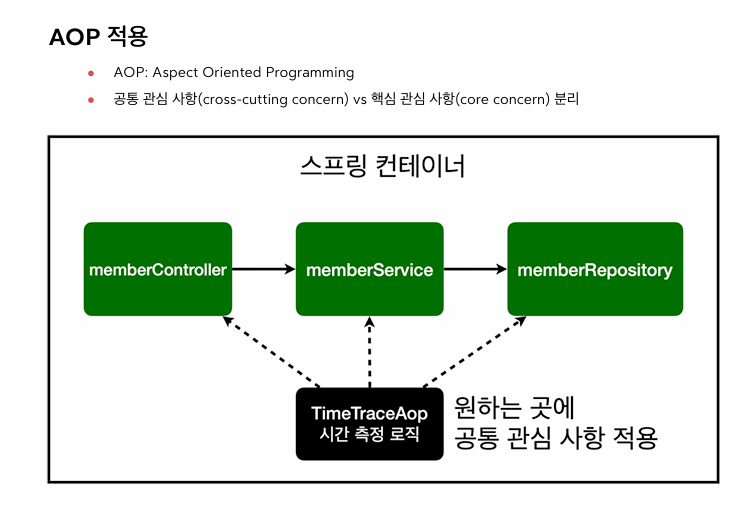
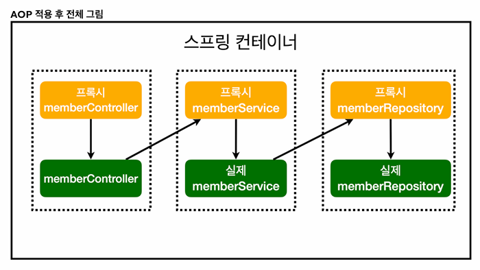

# AOP

## AOP가 필요한 상황?
1. 모든 메소드의 호출 시간을 측정하고 싶을때

2. 공통 관심 사항 vs 핵심 관심사항

3. 회원 가입 시간, 회원 조회 시간을 측정하고 싶다면?

- 문제는 회원 가입, 회원 조회에 시간을 측정하는 기능은 핵심 관심 사항이 아니다.

- 시간 측정 로직과 비즈니스 로직이 섞여서 유지보수가 어렵다

- 시간 측정은 공통 관심 사항이다.

- 시간을 측정하는 로직을 변경할때 모든 로직을 변경해야한다.

- 시간을 측정하는 로직을 공통로직으로 만들기 매우 어렵다.

- 중간에 인터셉터해서 조건을 걸고 통과시키는 등 여러가지 방법으로 활용할수 있다.

## 어떻게 동작함?

- 실제 메소드 호출전, 프록시를 만들고 프록시가 joinPoint.proceed()를 통해서 원본을 호출한다.(프록시 타입의 AOP)