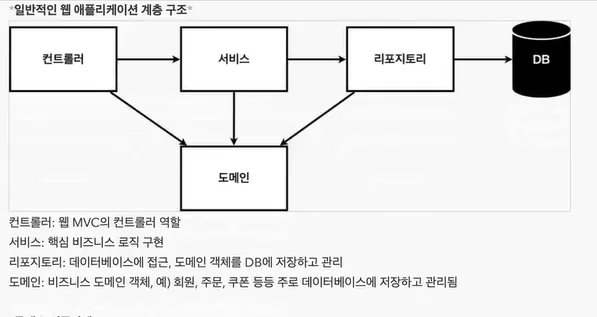

# 회원 관리 예제

- 비즈니스 요구사항 정리
- 회원 도메인과 레포지토리 만들기
- 회원 레포지토리 테스트 케이스 작성
- 회원 서비스 개발
- 회원 서비스 테스트

## 비즈니스 요구사항 정리

- 데이터 : 회원 ID , 이름
- 기능 : 회원등록 , 조회
- 아직 데이터 저장소가 선정되지 않음(가상의 시나리오)
- 만들 웹 애플리케이션 구조


- 클래스 구현


### 테스트케이스 작성&실행방법

> 개발한 기능을 테스트할 때 자바의 main 메서드를 통해서 실행하거나 웹 애플리케이션의 컨트롤러를 통해서 해당 기능을 실행하는 방법은 준비하고 실행하는데 오래걸리고, 반복 실행하기 어렵고 여러 테스트를 한번에 실행하기 어렵다는 단점이 있다. 자바는 JUnit이라는 프레임워크로 테스트를 실행해서 이러한 문제를 해결한다.
> 
- JUnit 사용 방법을 숙지해야함
- 테스트는 순서가 보장되지 않으며, 순서에 의존해야하는 설계는 잘못된 설계이다.
`import static org.assertj.core.api.Assertions.*;` 를 많이 사용한다.

```java
        // 예제 코드
        assertThat(result.size()).isEqualTo(2);
        assertThat(result).isEqualTo(member1);
```

### @AfterEach 어노테이션

각 테스트 케이스가 끝날때마다 자동으로 해당 메소드가 실행되게 하는 어노테이션이다

### TDD

테스트 케이스를 먼저 만들고 개발을 하는 것을 TDD(테스트 주도 개발)이라고 하는 방법론이다.

### 왜 해야함?

나 혼자 개발할때는 문제가 없지만, 여러 사람이 동시에 개발할 경우 무조건 필요하다.

없으면 많은 문제가 생기기 때문에, 필수적으로 공부를 해야한다.

## 회원 서비스 개발

### Optional 객체

`get()` 를 통해서 가져오거나, 이를 활용해서 다양한 메소드를 활용할 수 있고 현대적인 방식으로 많이 사용된다.

```java
// 예제 코드
        result.ifPresent(m-> {
            throw new IllegalStateException("이미 존재하는 회원 입니다.");
        });
```

### Service

Service의 메소드는 비즈니스 로직과 가깝게 직관적으로 만들어야 소통이 원활해진다.

### Repository

보통 개발스러운 용어를 선택한다.

## 테스트 케이스 만들기

> 테스트 케이스 메소드는 한글로 해도 상관이 없고, 실제로 많이 사용한다.

### given when then 문법

> given : 무언가가 주어졌을때

> when : 이거를 실행했을때

> then : 결과가 이게 나와야함

- 사용 권장 문법
- 직관적으로 이해하기가 쉽다
- 상황에 맞지 않을때도 있지만, 이 것을 기반으로 바꾸는 것을 추천한다.

#### 테스트에서 가장 중요한 점
> 엣지 케이스를 잘 확인해야한다.
> 일반적인 플로우의 테스트는 반쪽짜리 테스트이다.

#### 편하게 쓰기 위한 문법
```java
        assertThrows(IllegalStateException.class , ()-> {
            memberService.join(member2);
        });
        // assertThrows(예외클래스, 예외가 발생할 상황)
```
#### 같은 인스턴스를 사용해야한다.

```java
// 변경 전
        // MemberServiceTest
    private final MemberRepository memberRepository = new MemoryMemberRepository();
// 변경 후
        // MemberService
    private final MemberRepository memberRepository;

    public MemberService(MemberRepository memberRepository){
        this.memberRepository = memberRepository;
    }
    ...
        // MemberServiceTest
    MemberService memberService;
    MemoryMemberRepository memberRepository;


    @BeforeEach
    public void beforeEach(){
        memberRepository = new MemoryMemberRepository();
        memberService = new MemberService(memberRepository);
    }

    // memberService입장에서는 자신이 생성하지 않은 객체를 외부에서 주입받는다
    // 이를 DI(Dependency Injection, 의존성 주입) 이라고 한다.
```


### JUnit 의 특징

> 같은 패키지라면 import를 하지 않아도 사용이 가능함

```java
package hello.hello_spring.service;

import hello.hello_spring.domain.Member;
import org.junit.jupiter.api.Test;

import static org.junit.jupiter.api.Assertions.*;
class MemberServiceTest {

    MemberService memberService = new MemberService();
        // import없이 사용 가능하다
    ...
```

Java에서 **패키지(package)** 는 디렉토리와는 별개로 논리적인 네임스페이스(namespace) 개념이다. 즉, 물리적으로 파일이 존재하는 디렉토리 구조와, 파일이 속한 패키지는 일치할 필요는 없지만, 일반적으로 패키지명과 디렉토리 구조는 맞춰서 사용하는 것이 관례이다.

#### 폴더가 다르더라도 패키지는 같을 수 있다
하지만 물리적인 디렉토리 위치와 패키지 명칭은 반드시 일치할 필요는 없다. 즉, 폴더가 달라도 패키지는 동일할 수 있다.

예를 들어, src/test/java 디렉토리 안에 있는 테스트 클래스가 src/main/java의 클래스들과 같은 패키지명을 가질 수 있다.

예시:
`src/main/java/hello/hello_spring/service/MemberService.java` 에 있는 클래스
`src/test/java/hello/hello_spring/service/MemberServiceTest.java` 에 있는 클래스
이 두 클래스는 다른 폴더에 위치하고 있지만, 같은 패키지 hello.hello_spring.service에 속할 수 있다. Java에서는 패키지명이 같다면, 패키지가 같다고 인식한다. **폴더가 다르더라도**.

### Namespace

> 네임스페이스(namespace)는 프로그램 내에서 이름의 충돌을 피하기 위해 서로 다른 식별자나 변수, 함수 등을 구분하는 논리적인 공간을 말한다. 특히 규모가 큰 프로젝트나 여러 라이브러리를 사용하는 경우, 같은 이름의 변수가 겹치는 것을 방지할 수 있어 유용하다. 

> Java에서는 패키지를 사용해 네임스페이스를 구현한다. 패키지는 클래스들을 논리적으로 그룹화하여 이름 충돌을 방지하고, 코드의 가독성과 재사용성을 높이는 역할을 한다.

#### 쓰는 이유
- `package` 키워드를 사용해 각 클래스가 속한 패키지를 명시한다.
- 다른 패키지에 있는 클래스는 `import` 키워드를 통해 가져온다.
- 이로 인해 이름 충돌을 방지하고, 각 기능별로 모듈화해 가독성을 높일 수 있다


