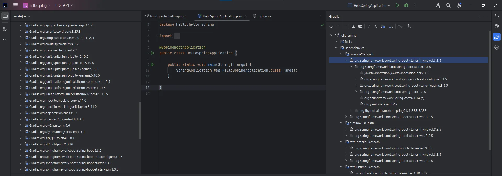

- spring boot 실행할때 library를 추가시킬 수 있다
- 웹 서버 구축에 필요한 라이브러리를 기본적으로 가져온다(외부 라이브러리 항목에 있음)
- Gradle은 서로 의존성이 있는 라이브러리를 모두 가져온다

- 한 라이브러리를 받게되면 그 라이브러리에서 필요한 모든 라이브러리를 가져와서 의존성 관리를 해준다.
- 요즘에는 서버를 새롭게 만들고 설치할 필요없이 서버가 embed되어있다.

## 로그를 쓰는이유

- 실무에서는 Logging을 사용해야한다
- log4j, logback등을 사용하는데 logback을 많이 사용한다.
- log4j는 인터페이스
- syso을 사용 못한다(synchronized 가 들어가있어서 성능 이슈가 생김)

## 핵심 라이브러리

### 스프링 부트 라이브러리

- spring-boot-starter-web
    - spring-boot-starter-tomcat: 톰캣(웹서버)
    - spring-webmvc:스프링 웹 MVC
- spring-boot-starter-thymeleaf: 타임리프 템플릿 엔진(View)
- spring-boot-starter(공통): 스프링 부트 + 스프링 코어 + 로깅
    - spring-boot
        - spring-core
    - spring-boot-starter-logging
        - logback,slf4j

### 테스트 라이브러리

- spring-boot-starter-test
    - junit : 테스트 프레임워크
    - mockito: 목 라이브러리
    - assertj: 테스트 코드를 좀 더 편하게 작성하게 도와주는 라이브러리
    - spring-test: 스프링 통합 테스트 지원