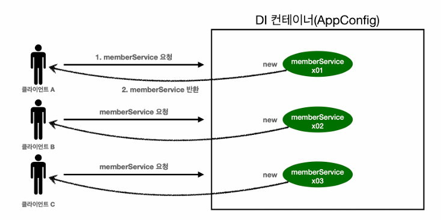

# Singleton

> JVM안에 인스턴스가 하나만 필요할때 쓰는 디자인패턴



- 기존 우리가 만들었던 AppConfig 방식은 고객이 요청할때마다 관려있는 객체들이 새로 만들어지는 일이 벌어진다.
- 예를들어 큰 기업의 TPS(Transaction per second)는 50000에 가까울 수 있는데, 그럼 초당 5만+의 객체를 만들어내는 것은 너무나 비효율적이다.
- 그래서 객체를 singleton으로 만들어내는게 가능한 서비스로직이라면 singleton방식이 무조건 더 효율적이다.(메모리 낭비 줄임)

## Singleton 객체 만드는 방법

```java
    // 1. static 영역에 객체를 한개만 생성한다
    private static final SingletonService instance = new SingletonService();

    //2. public으로 열어 객체 인스턴스가 필요하면 static 메소드를 통해서만 조회하도록 허락한다.
    public SingletonService getInstance(){
        return instance;
    }

    // 3. 생성자를 private로 설정해서 외부에서 new 키워드를 통한 생성을 막는다.
    private SingletonService(){
    }
```


## 싱글톤 패턴의 장점/단점

### 장점
- 잘 만든 객체지향설계 프로그램은 컴파일 오류만으로 잘못된 행동을 막을 수 있다
- 다른 개발자가 new로 객체 생성을 하려던 것을 막는다
- 객체를 생성하는 비용이 1000이라면, 참조하는 비용은 1정도로 비유할 수 있다. 즉, 매우 경제적이다.
- 싱글톤 객체를 구현하는 방법은 이 방법많고도 많이 있다. 여기서는 가장 단순하고 안전한 방법을 선택함

### 단점
- 패턴 구현에 코드가 많이 들어간다.
- 클라이언트가 구체 클래스에 의존한다(DIP 위반)
- 테스트하기 어려움
- 자식 클래스 만들기 어렵다(private 생성자)
- 유연성이 떨어진다

## 스프링의 싱글톤 컨테이너

> 싱글톤 패턴의 단점을 모두 극복했다

> 스프링은 객체 인스턴스를 싱글톤으로 관리한다(Bean)

### 극복한 이유?
> 스프링 컨테이너가 싱글톤을 관리하기 때문에 개발자가 관리하는 영역에 들어가지 않아서 설계가 꼬이지 않기 때문에 극복이라고 표현한 것 같다.
- 싱글톤 패턴을 위한 지저분한 코드가 들어가지 않아도 된다
- DIP, OCP, 테스트, private 생성자로 부터 자유롭게 싱글톤을 사용할 수 있다

## 싱글톤 방식의 주의점
```java
    public void order(String name, int price){
        System.out.println("name = " + name + " price = " + price);
        //이곳이 문제가 된다.
        this.price = price;
       // 해결방법? return price로 값을 넘긴다.
    }
```

- 공유 필드가 있다면 문제가 발생할 수 있다
- 절대 싱글톤은 공유 필드를 만들지 말자
- Stateless로 반드시 만들어야한다
- 실무에서 자주 발생하는 문제이기 때문에 반드시 신경써서 만들어야한다
- 막상 터진다면 발견하기도 어려우니 정말 중요하다
- ex) 내 아이디인데 다른 사람의 쇼핑목록, 이름 등이 보이는 문제가 발생하게 된다.
- 로그를 모두 확인한 후 고쳐야되기 때문에 몇달은 걸리니 정말 조심해야한다.

## 싱글톤 객체 안의 객체는 싱글톤이여 한가?
> Spring이 관리하는 객체는 객체안의 객체도 싱글톤을 보장한다.


### 스프링은 어떻게 여러곳에 사용되는 객체인줄 알아서 한개만 생성하는 싱글톤 유지가 가능할까?

> @Configuration과 바이트코드 조작을 이용한다.

> @Configuration 어노테이션을 발견하면 CGLIB을 이용해서 객체를 생성한다(프록시방식)

```java
        ...
        MemberServiceImpl memberService = ac.getBean("memberService", MemberServiceImpl.class);
        OrderServiceImpl orderService = ac.getBean("orderService", OrderServiceImpl.class);
        MemberRepository memberRepository = ac.getBean("memberRepository" , MemberRepository.class);

        Assertions.assertThat(memberService.getMemberRepository()).isSameAs(memberRepository);
        Assertions.assertThat(orderService.getMemberRepository()).isSameAs(memberRepository);
        // JUnit 결과 : PASS
        ...
        AppConfig bean = ac.getBean(AppConfig.class);

        System.out.println("class : " + bean.getClass());
        // 예상 결과 = class : class hello.core.AppConfig
        // 결과 = class : class hello.core.AppConfig$$SpringCGLIB$$0
        // why? 예상과는 다르게 클래스에 xxxCGLIB가 붙으면서 복잡해진 것을 볼 수 있다. 이것은 내가 만든 클래
        //스가 아니라 스프링이 CGLIB라는 바이트코드 조작 라이브러리를 사용해서 AppConfig 클래스를 상속받은 임의의 다른
        //클래스를 만들고, 그 다른 클래스를 스프링 빈으로 등록한 것이다
```

- CGLIB은 바이트코드를 이용한 AOP를 사용하는 방식으로, 객체 생성 전 스프링 컨테이너를 찾은 뒤 없다면 객체를 만들어내는 방식으로 동작한다
- @Configuration 어노테이션을 사용하지 않으면 객체 안 객체의 싱글톤이 보장되지 않는다.