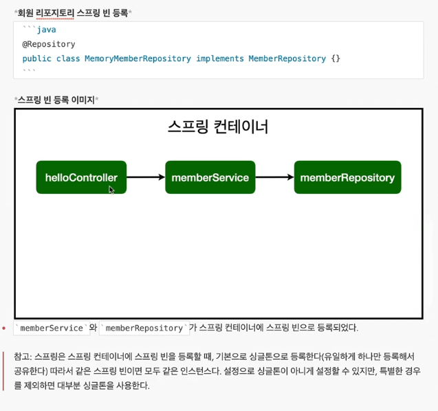
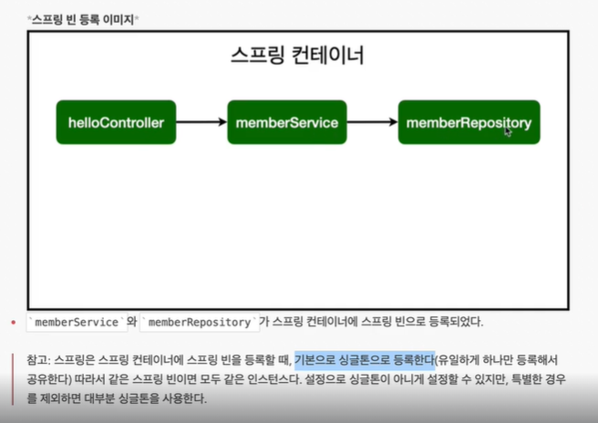
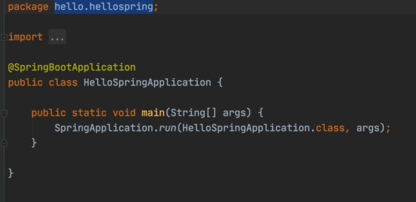

# Bean 
> 스프링이 어노테이션이 있다면 그 객체를 만들고 관리한다.

## Autowired
> 스프링이 DI를 통해서 해당 객체를 싱글톤으로 만들어 낸다.

> Why? 굳이 여러개의 객체가 필요없거나, 하나의 객체로 사용해야 정보가 공유되기 때문이다.

> 파라미터 받는 객체를 spring 컨테이너 안에 있다면, 넣어서 만들어준다. (즉, 어노테이션이 필요함)



## 스프링 빈을 등록하는 2가지 방법

> 컴포넌트 스캔과 자동 의존관계 설정

> 자바코드로 직접 스프링 빈 등록하기

### 컴포넌트 스캔과 자동 의존관계 설정

- `@Component` 애노테이션이 있으면 스프링 빈으로 자동 등록된다.
- `@Controller` 컨트롤러가 스프링 빈으로 자동 등록된 이유도 컴포넌트 스캔 때문이다. (구성을 보면 @Component 어노테이션이 포함되어있음)
- `@Component`를 포함하는 다음 애노테이션들도 스프링 빈에 자동 등록된다.
    - `@Controller`
    - `@Service`
    - `@Repository`

### 예제

```java
@Service
public class MemberService {

    private final MemberRepository memberRepository;

    @Autowired
    public MemberService(MemberRepository memberRepository){
        this.memberRepository = memberRepository;
    }
    // 생성자에 `@Autowired` 를 사용하면 객체 생성 시점에 스프링 컨테이너에서 
    // 해당 스프링빈을 찾아서 주입한다. 생성자가 한개만 있으면 `@Autowired` 는 생략이 가능하다.
    ...
   
```

#### Bean 등록 이미지



### 어느 범위까지 스캔되서 Bean으로 생성해주는가?



> 다른 특별한 설정을 하지 않았다면, 스프링 부트가 실행되는 메인메서드 패키지 하위의 것들만 Bean으로 만든다.

> 원리 : @ComponentScan 어노테이션이 있다면 스캔을 해준다

### 자바코드로 직접 스프링 빈 등록하기

```java
@Configuration
public class SpringConfig {

    @Bean
    public MemberService memberService(){
        return new MemberService(memberRepository());
    }

    @Bean
    public MemberRepository memberRepository(){
        return new MemoryMemberRepository();
    }
}
```

- XML로 설정하는 방식도 있지만 최근에는 잘 사용하지 않는다.

- DI에는 필드주입, setter주입, 생성자 주입 이렇게 3가지 방법이 있다. 의존 관계가 실행중에 동적으로 변하는 경우는 거의 없으므로 생성자 주입을 권장한다.

- 실무에서는 주로 정형화된 컨트롤러, 서비스, 레포지토리 같은 코드는 컴포넌트 스캔을 사용한다. 그리고 정형화 되지 않거나, 상황에 따라 구현 클래스를 변경해야 하면 설정을 통해 스프링 빈으로 등록한다.

- 주의 : `@Autowired` 를 통한 DI는 `helloController` , `MemberController` 등과 같이 스프링이 관리하는 객체에서만 동작한다. 스프링 빈으로 등록하지 않고 내가 직접 생성한 객체에서는 동작하지 않는다.