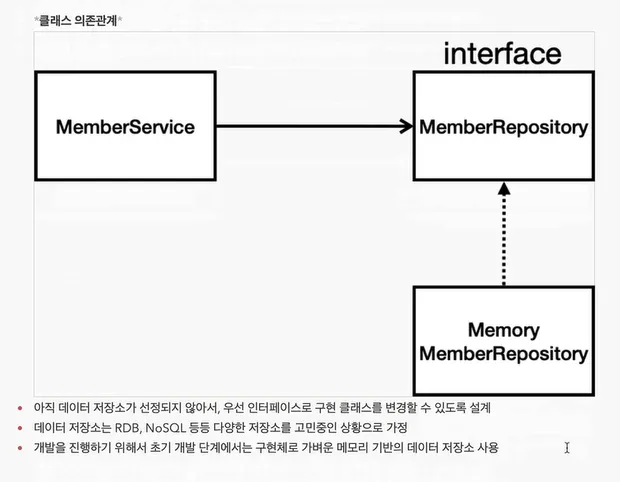

# 회원 관리 예제

- 비즈니스 요구사항 정리
- 회원 도메인과 레포지토리 만들기
- 회원 레포지토리 테스트 케이스 작성
- 회원 서비스 개발
- 회원 서비스 테스트

## 비즈니스 요구사항 정리

- 데이터 : 회원 ID , 이름
- 기능 : 회원등록 , 조회
- 아직 데이터 저장소가 선정되지 않음(가상의 시나리오)
- 만들 웹 애플리케이션 구조


- 클래스 구현



### 테스트케이스 작성&실행방법

> 개발한 기능을 테스트할 때 자바의 main 메서드를 통해서 실행하거나 웹 애플리케이션의 컨트롤러를 통해서 해당 기능을 실행하는 방법은 준비하고 실행하는데 오래걸리고, 반복 실행하기 어렵고 여러 테스트를 한번에 실행하기 어렵다는 단점이 있다. 자바는 JUnit이라는 프레임워크로 테스트를 실행해서 이러한 문제를 해결한다.
> 
- JUnit 사용 방법을 숙지해야함
- 테스트는 순서가 보장되지 않으며, 순서에 의존해야하는 설계는 잘못된 설계이다.
`import static org.assertj.core.api.Assertions.*;` 를 많이 사용한다.

```java
        // 예제 코드
        assertThat(result.size()).isEqualTo(2);
        assertThat(result).isEqualTo(member1);
```

### @AfterEach 어노테이션

각 테스트 케이스가 끝날때마다 자동으로 해당 메소드가 실행되게 하는 어노테이션이다

### TDD

테스트 케이스를 먼저 만들고 개발을 하는 것을 TDD(테스트 주도 개발)이라고 하는 방법론이다.

### 왜 해야함?

나 혼자 개발할때는 문제가 없지만, 여러 사람이 동시에 개발할 경우 무조건 필요하다.

없으면 많은 문제가 생기기 때문에, 필수적으로 공부를 해야한다.

## 회원 서비스 개발

### Optional 객체

`get()` 를 통해서 가져오거나, 이를 활용해서 다양한 메소드를 활용할 수 있고 현대적인 방식으로 많이 사용된다.

```java
// 예제 코드
        result.ifPresent(m-> {
            throw new IllegalStateException("이미 존재하는 회원 입니다.");
        });
```

### Service

Service의 메소드는 비즈니스 로직과 가깝게 직관적으로 만들어야 소통이 원활해진다.

### Repository

보통 개발스러운 용어를 선택한다.