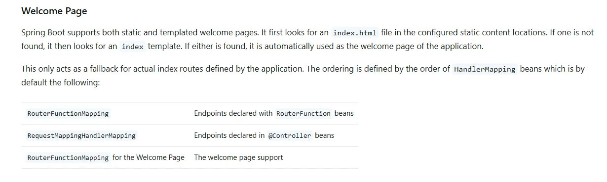
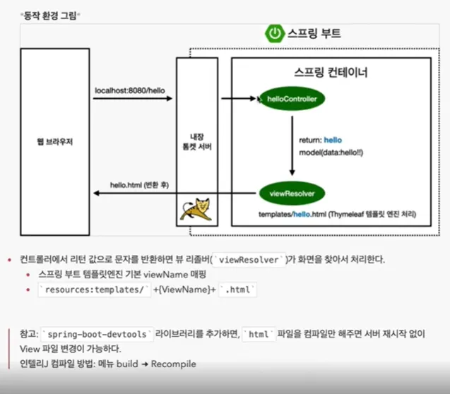

# SpringBoot

- spring의 기능은 너무 많아서 다 기억할수 없기 때문에 필요할 때 마다 찾아서 써야해서 찾는 능력이 중요하다
    - https://docs.spring.io/spring-boot/index.html에서 기능을 찾아서 확인 해 볼수 있다.
    - ex) Welcome Page 검색
    
    
    

## Spring Boot의 기본동작

- hello로 get요청이오면, 톰캣서버를 통해 스프링 컨테이너에서 hello와 매핑된 helloController가 실행된다.
- getmapping으로 연결된 메소드가 실행되고, return에 있는 값(hello)을 뷰리졸버가 해당되는 html파일을 찾아서 매핑시킨다.

## 빌드하는법

- intellij ide에서 진행
1. 콘솔에 들어간다
2. ./gradlew.bat build (윈도우는 gradlew가 아닌 gradlew.bat으로 build)
3. cd build/libs
4. java -jar hello-spring-0.0.1-SNAPSHOT.jar
5. 실행확인

오류가 생길 경우 2단계에서 ./gradlew.bat clean build를 입력한다(build 폴더 삭제) 

서버를 배포할때 해당 jar파일만을 업로드하고 실행 시키면 된다. 그러면 spring이 실행됨

## Thymeleaf

- spring boot에서 기본적으로 제공하는 템플릿 엔진