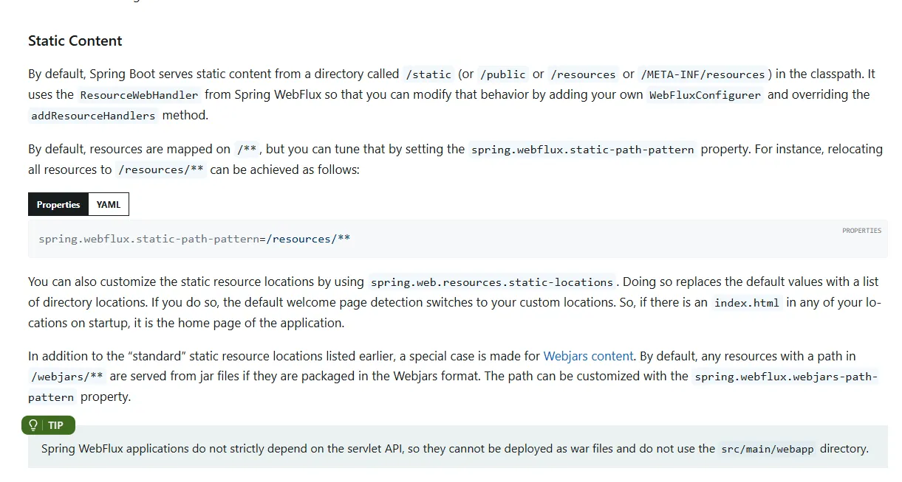
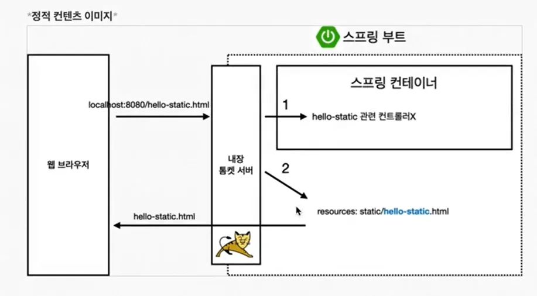
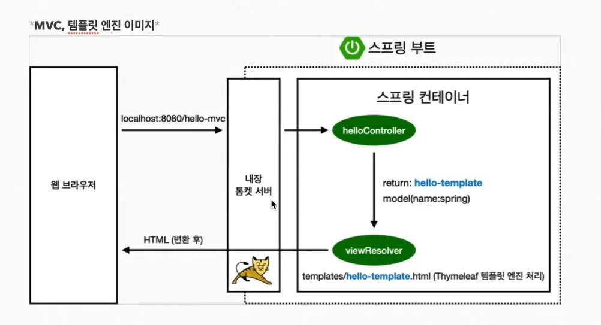
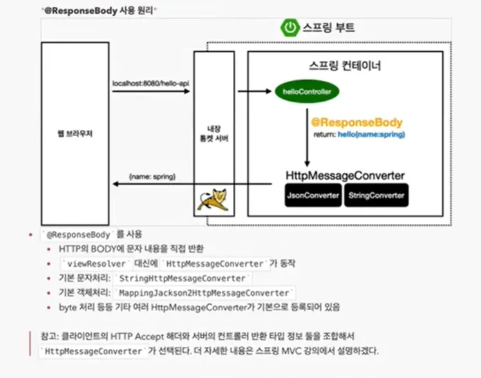

# Spring Web 개발

> 크게 3가지 방식이 있다(정적 컨텐츠/MVC와 템플릿 엔진/API)

정적 컨텐츠

- 스프링 부트는 정적 컨텐츠 기능을 기본적으로 제공한다.
- https://docs.spring.io/spring-boot/reference/web/reactive.html#web.reactive.webflux.static-content

### 원리

## MVC와 템플릿 엔진

- Model, View, Controller
- 관심사를 분리하기 위한 목적으로 만들어졌다
- **MVC** 패턴은 웹 애플리케이션을 개발할 때 **관심사의 분리**를 통해 코드의 가독성, 재사용성, 유지보수성을 높이기 위한 구조적 접근법이다. 이 패턴은 **Model**, **View**, **Controller** 세 가지 주요 컴포넌트로 나뉘며, 각 컴포넌트는 특정 역할을 담당한다.

### 원리

### View

- view는 화면을 그리는 것에만 집중한다

### Model

- Model은 화면에 필요한 것을 담아서 넘겨준다
- **Model**은 애플리케이션의 **데이터**와 **비즈니스 로직을 담당한다**

### Controller

- **Controller**는 **Model**과 **View** 사이의 연결 역할을 한다

## API

static page나 mvc처럼 화면을 받는 것이 아닌 데이터를 받아오는 방식

어노테이션 Responsebody에 의해서 작동된다

### 원리

- 기본적으로 json으로 전달한다.
- 특별히 실무에서도 설정을 바꿔서 사용하지 않으니, 그냥 사용해도 괜찮음