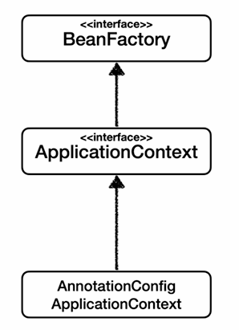
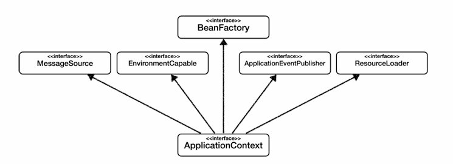

# BeanFactory / ApplicationContext

## BeanFactory

- 스프링 컨테이너의 최상위 인터페이스
- 빈을 관리, 조회
- getBean()을 제공한다

## ApplicationContext
- BeanFactory의 기능을 "모두" 상속받아 제공한다.
- 빈을 관리하고 검색하는 기능을 BeanFactory가 제공해주는데 차이는?
- 관리/검색기능이 아닌 다른 부가 기능을 사용할 수 있다.

- MessageSource를 활용한 국제화 기능
    - 한국에선 한국어, 영어권에선 영어로
- EnvironmentCapable(환경변수)
    - 로컬, 개발, 운영 등을 구분해서 처리
- ApplicationEventPublisher
    - 이벤트를 발행하고 구독하는 모델을 편리하게 지원
- ResourceLoader
    - 파일, 클래스패스, 외부 등에서 리소스를 편하게 조회

## Recap

- BeanFactory를 직접 사용하지않고, 주로 부가기능이 표함된 ApplicationContext를 사용한다.
- BeanFactory / ApplicationContext를 스프링 컨테이너라고 표현한다.