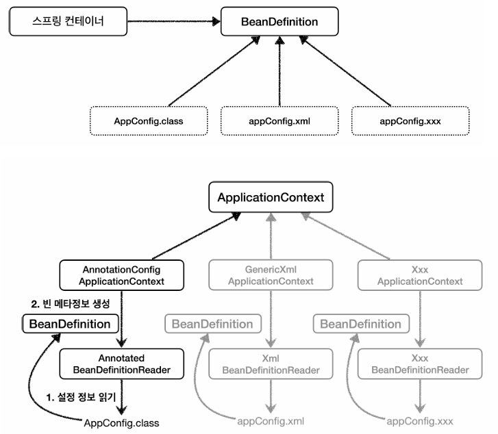

# Bean

- BeanDefinition은 인터페이스이며, 메타정보를 저장한다.
- 객체지향설계가 잘된 예시로써, 스프링 컨테이너는 하위에 대해서 모르고 BeanDefinition 인터페이스만을 바라본다.
- 거의 사용할 일이 없다.. 하지만 가끔 사용할 수도 있음
- 스프링 오픈소스나 라이브러리에서 이런식으로 등록하기도 하니까 BeanDefinition이 Bean의 메타정보라는 것은 알기
- AppConfig를 통해서 Bean을 등록하는 방식은 팩토리 메소드(Factory 패턴)를 통해서 등록하는 방식이다.