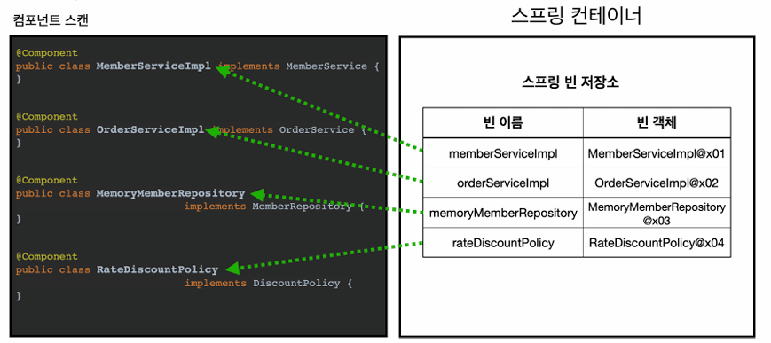

# Component Scan 

> 최신 스프링 부트를 쓴다면 @ComponentScan을 쓸 필요가없다, 하지만 알아놓는게 좋다(@SpringBootApplication에 들어가 있는 기능이다.)

> 스프링은 설정 정보 없이도 자동으로 스프링 빈을 등록하는 컴포넌트 스캔(@ComponentScan)이라는 기능을 제공한다.

> 스프링은 의존관계 자동 주입 `@Autowired` 기능을 제공한다.

- 빈 이름 전략 : 클래스명(첫글자는 무조건 소문자로)
- `@Component("이름")` 으로 이름 변경 가능
- 자동으로 주입해주기 때문에 의존관계를 주입할 수 없다. 그럼 어떻게 주입해야함? => @Autowired

## @Autowired
- 생성자에 @Autowired 를 지정하면 스프링 컨테이너가 해당 스프링 빈을 찾아서 주입한다.
- `getBean(MemberRepository.class)` 와 동일한 동작을 한다.
- 파라미터가 많아도 다 찾아서 자동으로 주입한다.

## @ComponentScan

- 파라미터 `basePackages` , `basePackageClasses` , `excludeFilters`
- 검색 위치를 설정하지 않는다면, 해당 어노테이션이 있는 패키지를 포함한 하위 패키지를 모두 검색한다.
- 그래서 최근 권장 방법은 최상위 패키지에 @ComponentScan이 있는 클래스를 두는 것이다.

## @Component가 포함된 어노테이션

> 어노테이션은 상속관계가 없다. 애노테이션이 특정 애노테이션을 인식하는 것은 자바가 지원하는 기능이 아니고 스프링이 지원하는 기능이다.

- @Component
- @Controller
- @Service
- @Repository
- @Configuration

## 필터

> includeFilter

> excludeFilter

- 별로 많이는 사용하지 않는다.. ComponentScan이 있는 SpringbootApplication 사용 이후..
- exclude는 가끔 사용하니, 알아두면 좋다

## 중복 등록과 충돌

### 자동 빈 등록 vs 자동 빈 등록
> 자동 빈 등록 이름과 자동 빈 등록 이름이 같을 때
> `ConfilictingBeanDefinitionException` 예외 발생

### 자동 빈 등록 vs 수동 빈 등록

- 수동 등록 빈이 우선권을 가진다.

- 수동 빈이 자동 빈을 오버라이딩 해버린다.

- 애매한 버그들이 많이 발생해서 잘못 발생하면 잡기 정말 어렵다. 개발은 모두가 같이 하는 것이라 정확한 가이드라인이 필요하다