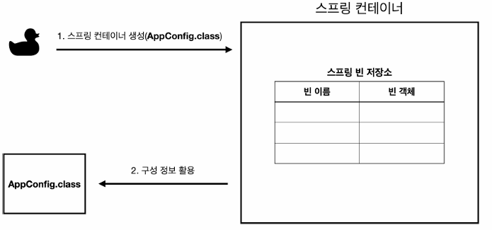
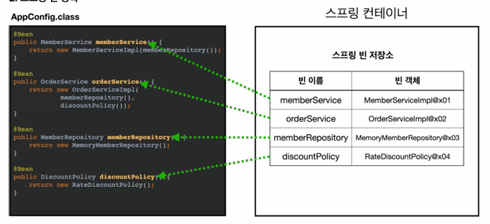

# IoC , DI , Container

## IoC (Inversion of Control) 제어의 역전

1. 기존 프로그램은 구현 객체가 스스로 필요한 서버 구현 객체를 생성하고 연결하고 실행했다. 한마디로 구현 객체가 프로그램의 제어 흐름을 스스로 조종했다.

2. 반면 AppConfig가 등장한 후 구현 객체는 자신의 로직을 실행하는 역할만 가지고있다. 프로그램 제어 흐름은 이제 AppConfig가 가져간다. `OrderServiceImpl` 에 필요한 인터페이스를 호출하지만 어떤 구현 객체들이 실행 될지 모른다.

3. 프로그램 제어 흐름에 대한 권한은 모두 AppConfig가 가지고 있다. 심지어 `OrderServiceImpl` 도 AppConfig가 직접 생성한다.

4. `OrderServiceImpl` 은 자신을 실행시키는 것은 모른체 묵묵히 자신의 로직을 실행시킨다.

5. 이렇게 프로그램 제어 흐름을 직접 제어하는 것이 아니라 외부에서 관리하는 것을 제어의 역전(IoC)라고 한다.

## 프레임워크 / 라이브러리의 차이

> 프레임워크는 내가 작성한 코드를 제어하고 대신 실행하면 그것은 프레임워크가 된다(JUnit)

> 내가 작성한 코드가 직접 제어의 흐름을 담당한다면 그것은 프레임워크가 아니라 라이브러리다.

## 의존관계 주입(DI , Dependency Injection)

> 의존관계는 정적인 클래스 의존 관계와 실행 시점에 결정되는 동적인 객체 의존관계를 분리해서 생각해야한다.

### 정적인 클래스 의존 관계

- 클래스가 사용하는 import 코드만 봐도 의존관계를 판단할 수 있다.
- 실행하지 않아도 의존 관계를 판단할 수 있다.

### 동적인 객체 인스턴스 의존 관계

- 애플리케이션 실행 시점(런타임)에 외부에서 실제 구현 객체를 생성하고 클라이언트에 전달해서 클라이언트와 서버의 실제 의존관계가 연결 되는 것을 의존관계 주입이라고 한다.
- 객체 인스턴스를 생성하고, 그 참조값을 전달해서 연결된다.


## IoC 컨테이너, DI 컨테이너

> AppConfig 처럼 객체를 생성하고 관리하면서 의존관계를 연결해주는 것을 IoC/DI 컨테이너 라고 한다. (보통 DI 컨테이너라고 부른다)

> 어샘블러, 오브젝트 팩토리 등으로 불리기도 한다.

## 스프링 컨테이너

```java
       ...
        // 컨테이너 생성
        ApplicationContext applicationContext = new AnnotationConfigApplicationContext(AppConfig.class);
        MemberService memberService = applicationContext.getBean("memberService" , MemberService.class);
        OrderService orderService = applicationContext.getBean("orderService" , OrderService.class);
       ...
```

- ApplicationContext를 스프링 컨테이너라고 한다
- 기존에는 개발자가 직접 객체를 생성하고 DI 했지만, 스프링을 사용하면 스프링 컨테이너를 이용한다.
- 스프링 컨테이너는 @Configuration이 붙은 AppConfig를 설정 정보로 사용한다. @Bean이라고 적힌 메소드를 모두 호출해서 반환된 객체를 스프링 컨테이너에 등록한다.
- 이렇게 스프링 컨테이너에 등록된 객체를 스프링 빈이라고 한다.
- 스프링 빈은 @Bean이 분은 메소드 명을 Bean이름으로 사용한다.
- 스프링 빈 객체는 applicationContext.getBean()으로 찾는다.
- 기존에는 개발자가 직접 자바코드로 찾았다면 이제는 스프링 컨테이너에 객체를 등록하고 스프링 컨테이너에서 빈을 찾도록 바뀌었다.

## 그래서 스프링 컨테이너의 장점은 뭐임? 더 복잡해지는거 같은데

### 스프링 컨테이너
```java
       ...
        // 컨테이너 생성
        ApplicationContext applicationContext = new AnnotationConfigApplicationContext(AppConfig.class);
        // 해당 클래스는 ApplicationContext의 구현체
```



- ApplicationContext가 스프링 컨테이너이다.
- ApplicationContext는 인터페이스이다.
- AppConfig 방식이 자바 설정 클래스로 스프링 컨테이너를 만든 것이다.


### 스프링 빈


> 빈 이름은 절대 중복되면 안된다.

> 빈은 생성과 의존 관계 주입 단계가 나누어져있다. 하지만 AppConfig처럼 자바코드로 등록하면 단계가 나누어지지않는다.

