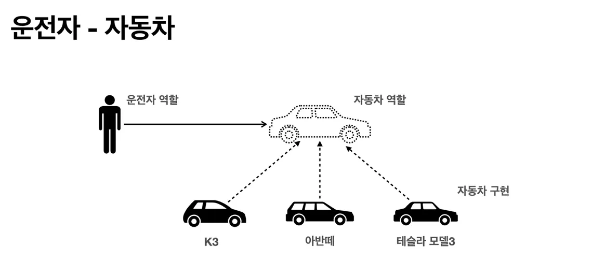
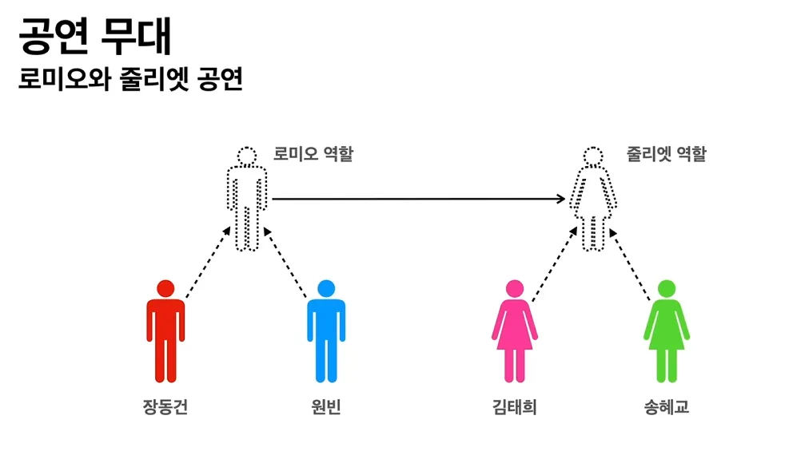
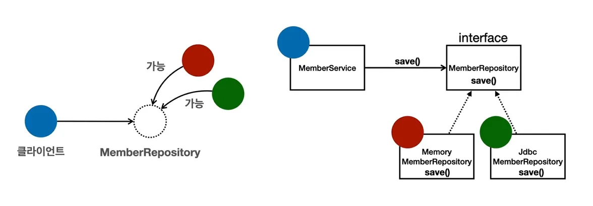

# OOP

> 스프링을 다형성을 극대화해서 이용할 수 있게 도와준다.

> 스프링을 사용하면 마치 공연 배우를 선택하듯이 구현을 편하게 변경할 수 있다.

## 객체 지향의 특징
1. 상속
2. **다형성**
3. 추상화
4. 캡슐화

## 객체 지향 프로그래밍(OOP)란?

- 컴퓨터 프로그램을 명령어의 목록으로 보는 시각에서 벗어나 여러개의 독립된 단위, 즉 "객체"들의 **모임** 으로 파악하고자 하는 것이다.
각각의 객체는 메시지를 주고 받고, 데이터를 처리할 수 있다(협력)

- 객체 지향 프로그래밍은 프로그램을 유연하고 변경이 용이하게 만들기 때문에 대규모 소프트웨어 개발에 많이 사용된다.

### 유연? 변경이 용이?

> 레고 블럭 조립하듯이

> 컴퓨터 부품 갈아끼우듯이

> 컴포넌트를 쉽고 유연하게 변경하면서 개발할 수 있는 방법

## "다형성" < 진짜 중요함

> 역할(인터페이스)과 구현(객체)으로 세상을 구분

> 객체를 설계할때 역할과 구현을 명확히 분리 해야한다.

> 객체 설계시 역할(인터페이스)을 먼저 부여하고, 그 역할을 수행하는 구현 객체 만들기



- 자동차와 운전자로 비유된 다형성에서, 운전자는 클라이언트이다.

- 자동차라는 역할을 만들고 구현을 분리한 이유는 뭘까? => 사실은 운전자를 위해서 분리한 것이다. => why? 운전자(클라이언트)는 자동차의 내부 구조를 몰라도 된다.

- 자동차를 아반떼에서 테슬라로 바꿔도, 운전자는 바뀔 필요가 없다.

- 즉, 자동차 세상을 무한히 확장할 수 있고 클라이언트는 안 바뀌어도된다.



- 로미오 역할은, 줄리엣 역할이 누구인지 굳이 몰라도 된다. 대본만 그대로 읊으면 된다.
- 언제든 다른 대상으로 대체가 가능하다.

### 실세계로의 비유?
1. 운전자 - 자동차
2. 공연 무대
3. 키보드 , 마우스 , 세상의 표준 인터페이스들
4. 정렬 알고리즘
5. 할인 정책 로직

### 역할과 구현을 분리
- 역할과 구현으로 구분하면 세상이 단순해지고 유연해지며 변경도 편리해진다.

#### 장점

- 클라이언트는 대상의 역할만 알면 된다
- 클라이언트는 구현 대상의 내부 구조를 몰라도 된다.
- 클라이언트는 구현 대상의 내부 구조가 변경되어도 영향을 받지 않는다.
- 클라이언트는 구현 대상 자체를 변경해도 영향을 받지 않는다.
- 인터페이스를 안정적으로 잘 설계하는 것이 중요

#### 한계

- 역할(인터페이스) 자체가 변하면 클라언트 서버 모두에 큰 변경이 발생한다.
- 자동차를 비행기로 변경해야 된다면?
- 대본 자체가 변경된다면?
- USB인터페이스가 변경 된다면?
- 결국 인터페이스를 안정적으로 잘 설계한느 것이 중요하다.

### 객체는 협력한다

- 혼자 있는 객체는 없다
- 클라이언트 : 요청 , 서버 : 응답
- 수 많은 객체 클라이언트와 객체 서버는 서로 협력 관계를 가진다.

### 자바 언어의 다형성

> 오버라이딩 / 오버로딩 으로 구현된다.



```java
// 예제코드
public class MemberService {
	//private MemberRepository memberRepository = new MemoryMemberRepository();
	private MemberRepository memberRepository = new JdbcMemberRepository();
}
/*
자바에서는 인터페이스의 구현체를 new로 만들어 낼수있다.
다형성이 적용되었으며, 자동 업캐스팅 된 상태이다.
*/
```

### 다형성의 본질

> 클라이언트를 변경하지 않고, 서버의 구현 기능을 유연하게 변경할 수 있다.
