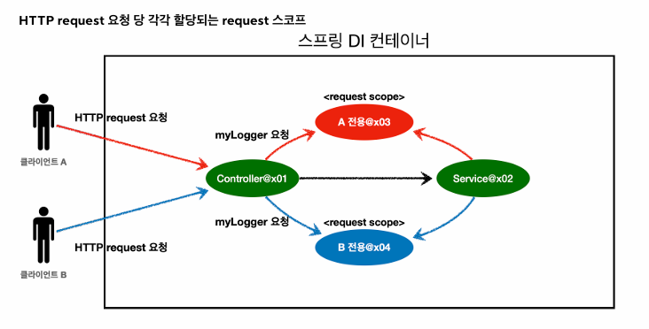

# Scope

> 빈은 스프링 컨테이너 시작과 함께 생성되어 종료될 때 까지 유지된다.
> 이것은 빈이 싱글톤 스코프로 생성되기 떄문이다

> 스코프는 빈이 존재할수 있는 범위를 뜻한다.

## 스프링의 스코프

- 싱글톤 : Default / 스프링 컨테이너의 시작과 끝까지 유지됨
- 프로토타입 : 프로토타입 빈의 생성과 의존관계 주입까지만 관여하고 더 이상 관여하지않는 매우 짧은 범위의 스코프

```java
        AnnotationConfigApplicationContext ac = new AnnotationConfigApplicationContext(SingletonBean.class);

        SingletonBean bean1 = ac.getBean(SingletonBean.class);
        SingletonBean bean2 = ac.getBean(SingletonBean.class);

        System.out.println("bean1 = " + bean1);
        System.out.println("bean2 = " + bean2);

        ac.close();
        /* close 호출하여도 테스트가 통과되는 이유는 뭘까?

        close()를 호출하면 스프링 컨테이너가 소멸하며, 내부적으로 관리하던 빈들도 소멸된다.
        하지만 이는 메모리에서 객체를 즉시 제거하는 것이 아니라, 컨테이너가 더 이상 객체를 관리하지 않는다는 의미다.
        즉, close() 호출 전 반환된 bean1, bean2는 여전히 JVM 힙 메모리에 존재하며, GC가 처리하기 전까지는 사용할 수 있다.
         
        */
        
        Assertions.assertThat(bean1).isSameAs(bean2); // 테스트 통과
```

### 프로토타입 빈

- 싱글톤 빈에 요청을하면 같은 주소의 객체(x01)을 반환해준다.
- 프로토타입 빈에 요청을 하면 요청마다 다른 주소의 객체(x01, x02, x03...)가 만들어지고 의존관계를 주입해서 반환한다.
- 스프링 컨테이너는 프로토타입 빈을 생성하고, 의존관계 주입, 초기화까지만 처리한다.
- 클라이언트에 빈을 반환하고, 이후 스프링 컨테이너는 생성된 프로토타입 빈을 관리하지 않는다. 프로토타입 빈을 관리할 책임
은 프로토타입 빈을 받은 클라이언트에 있다. 그래서 `@PreDestroy` 같은 종료 메서드가 호출되지 않는다.

### 프로토타입 빈과 싱글톤 빈을 동시에 사용하면 생기는 문제

- 싱글톤 빈은 한번만 생성되기 때문에, 내부에 프로토타입빈이 있는 객체를 만들 경우 프로토타입 빈 한개가 다른 모든 클라이언트에게 공유된다
- 이런 로직이라면 문제가 없지만, 보통 이런 로직이 아니기 때문에 문제가 된다
- 해결방법???(나는 사용할 때 마다 항상 새로운 프로토타입 빈을 만들고싶음)

> 1. 컨테이너에서 매번 받아오기(결과는 정상적으로 나오지만 테스트 만들기도 어렵고 너무 복잡해진다)
> 2. 이렇게 필요할때마다 의존관계를 찾는 것을 DL(Dependency Lookup)이라고 한다.
> 3. 프로토타입 빈을 컨테이너가 DL만 해주면 된다.
> 4. ObjectProvider / ObjectFactory를 @Autowired를 받아서 해결한다.

###
```java
        @Autowired
        private ObjectProvider<PrototypeBean> prototypeBeanProvider;

        public int logic(){
            PrototypeBean prototypeBean = prototypeBeanProvider.getObject();
```
1. 왜 ObjectProvider<PrototypeBean>는 만든적도 없는데 Autowired로 동작하는가?
> 컨테이너가 만들어질때 기본으로 생성되는 것이라 주입 받을 수 있다.

2. ObjectProvider는 인터페이스인데 왜 getObject메소드로 객체를 반환해줄수 있나?
> ObjectProvider는 인터페이스일 뿐이고, 실제로는 스프링 컨테이너가 제공하는 구현 클래스가 동작해서
> 결과를 반환한다. 즉, getObject() 메서드도 스프링의 구현 클래스에서 정의된 방식대로 동작하여,
> 스프링 컨테이너로부터 적절한 결과를 반환하는 것이다.

3. 
```java
        ClientBean clientBean1 = ac.getBean(ClientBean.class);
        int count1 = clientBean1.logic();
        Assertions.assertThat(count1).isEqualTo(1);

        ClientBean clientBean2 = ac.getBean(ClientBean.class);
        int count2 = clientBean2.logic();
        Assertions.assertThat(count2).isEqualTo(1);
```
- 위 클래스를 사용한다면 해당 테스트가 통과한다.
- 왜? Provider를 사용하면  clientBean1, 2 객체는 요청 될때마다 동적으로 프로토타입 빈이 주입되는 상황이기 때문이다

4. jakarata 제공 API로 사용 가능
- 장점 : 다른 컨테이너에서 사용 가능/단순함
- 단점 : 라이브러리 가져와야함/기능이 적음

### Recap
- 그래서 어디에 사용해야함?
    - 의존 관계 주입이 완료된 새로운 객체가 필요하면 사용하면 된다.
    - 하지만 막상 실무에서는 거의 사용할일이 없다.
    - 하지만 중요한 개념이라서 반드시 알아야한다.
    - 코드 분석할때 중요


## 웹 관련 스코프

> 특징 : 웹 스코프는 웹 환경에서만 동작한다

> 웹 스코프는 프로토타입과 다르게 프로토타입이 해당 스코프의 종료시점까지 관리한다. 따라서 종료 메서드가 호출된다.

- Request : HTTP 요청 하나가 들어오고 나갈때까지 유지되는 스코프, HTTP 요청 마다 별도의 빈 인스턴스가 생성됨
- Session : HTTP Session과 동일한 생명주기를 가진다
- application : `ServletContext` 와 동일한 생명주기를 가지는 스코프
- Websocket : 웹 소켓과 동일한 생명주기를 가지는 스코프



- 클라이언트에서 요청을 받으면 `전용 객체` 가 생겨서 요청을 한 객체가 관리한다.
- HTTP 요청 하나당 한개의 Request가 생성된다.
- Response가 나가게 될때, 객체가 destroy되면서 라이프 사이클이 끝나게 된다.

- proxy 객체를 이용해서 주입할 수 있다. Scope , proxy 설정이 있음
- 핵심 어이디어는 필요할 때 까지 지연처리가 된다는 점이다.
- 애노테이션 설정만으로 원본 객체가 프록시 객체로 된다는것이 다형성과 DI 컨테이너가 가진 큰 장점이다.