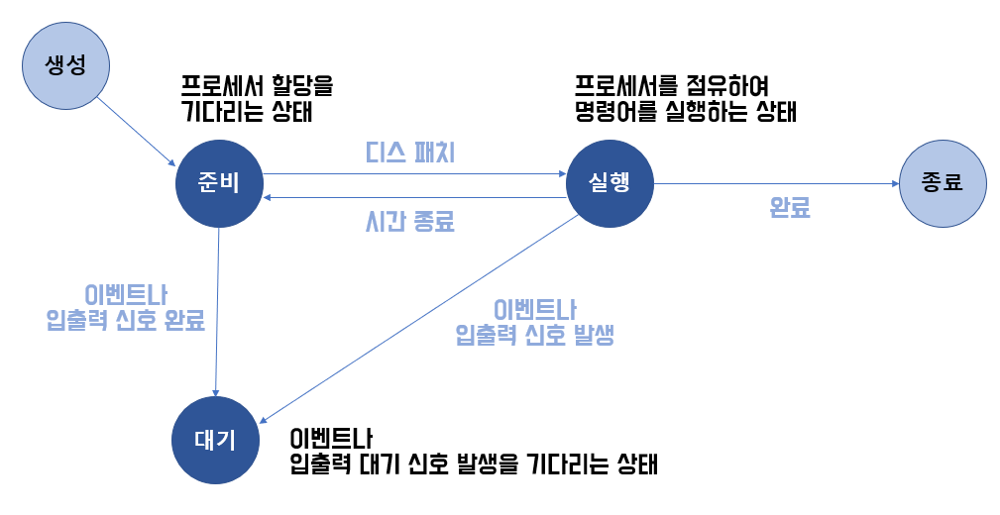

# 프로세스 관리 (Process Management)
여러 개의 프로그램(프로세스)을 동시에 실행하는 것처럼 보이게 하기 위해서
## 프로세스의 5가지 주요 상태

상태|설명
---|---
New (생성 상태)|새로운 프로세스가 생성되었지만 아직 실행 준비가 안 된 상태
Ready (준비 상태)|실행할 준비가 되어 있지만, CPU를 할당받지 못한 상태
Running (실행 상태)|CPU를 할당받아 실행 중인 상태
Waiting (대기 상태)|I/O 요청 등으로 인해 CPU를 사용하지 못하고 기다리는 상태
Terminated (종료 상태)|실행이 끝나거나 강제 종료된 상태

## 프로세스 상태 변화 정리
상태 변화|발생 이유|컨텍스트 스위칭 관련 여부
---|---|---
New → Ready|새로운 프로세스 생성 후 실행 준비 완료|❌ (컨텍스트 스위칭과 무관)
Ready → Running|CPU가 프로세스를 실행|✅ (CPU 할당)
Running → Ready|타임 퀀텀 만료 등으로 CPU를 빼앗김|✅ (컨텍스트 스위칭)
Running → Waiting|I/O 요청, 사용자 입력 대기 등으로 CPU를 사용하지 못함|❌ (CPU 사용 불가, 스케줄링 필요)
Waiting → Ready|I/O 작업이 끝나 다시 실행 준비 완료|❌ (컨텍스트 스위칭 없음)
Running → Terminated|실행 완료 또는 강제 종료|❌ (프로세스가 완전히 종료됨)
## PCB (Process Control Block, 프로세스 제어 블록)
운영체제가 각 프로세스를 관리하기 위해 저장하는 정보의 집합  

프로세스를 실행하거나 멈출 때, 프로세스의 정보를 PCB에 저장해 두었다가 다시 불러와 실행을 이어갈 수 있다

PCB에 포함되는 주요 정보

분류|설명
---|---
PID (Process ID)|프로세스의 고유한 식별번호
프로세스 상태|실행(Running), 대기(Waiting), 준비(Ready) 등의 현재 상태
프로그램 카운터 (PC, Program Counter)|다음에 실행할 명령어의 메모리 주소
CPU 레지스터|프로세스가 실행되던 당시의 CPU 레지스터 값 (일시 중단 후 재개할 때 필요)
메모리 정보|프로세스가 사용하는 메모리 주소 공간 (코드, 데이터, 스택, 힙)
입출력 정보|프로세스가 사용 중인 파일, 장치 등의 정보
스케줄링 정보|우선순위(Priority), 스케줄링 큐에 대한 정보
계정 정보|사용자 ID(UID), 그룹 ID(GID), 사용 권한 등
CPU 사용 시간|프로세스가 CPU를 얼마나 사용했는지 기록
