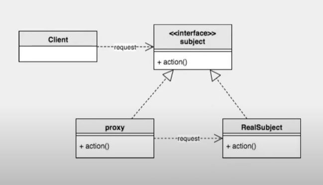

# 2주차 스터디 정리

> Proxy / DI Container / HTTP통신 

## Design Pattern - Proxy



> Spring에서 런타임시 객체가 만들어지는 대부분의 경우, Proxy 디자인 패턴을 사용한다.

> 프록시 패턴(Proxy Pattern)은 대상 원본 객체를 대리하여 대신 처리하게 함으로써 로직의 흐름을 제어하는 행동 패턴이다.

### 사용하는 이유

> 원본 객체를 수정할수 없는 상황일 때를 극복하기 위해서 사용한다.

- 보안(Security) : 프록시는 클라이언트가 작업을 수행할 수 있는 권한이 있는지 확인하고 검사 결과가 긍정적인 경우에만 요청을 대상으로 전달한다.
- 캐싱(Caching) : 프록시가 내부 캐시를 유지하여 데이터가 캐시에 아직 존재하지 않는 경우에만 대상에서 작업이 실행되도록 한다.
- 데이터 유효성 검사(Data validation) : 프록시가 입력을 대상으로 전달하기 전에 유효성을 검사한다.
- 지연 초기화(Lazy initialization) : 대상의 생성 비용이 비싸다면 프록시는 그것을 필요로 할때까지 연기할 수 있다.
- 로깅(Logging) : 프록시는 메소드 호출과 상대 매개 변수를 인터셉트하고 이를 기록한다.
- 원격 객체(Remote objects) : 프록시는 원격 위치에 있는 객체를 가져와서 로컬처럼 보이게 할 수 있다.

### 사용 예제(Lazy initialization)
- 롤 화면 로딩
- 이미지 로딩
- 카카오톡 친구 목록 로딩

### 단점
- 복잡성 증가 : 프록시 객체를 추가함으로써 클래스와 객체 간의 관계가 더 복잡해진다.
- 성능 저하 : 프록시는 요청을 실제 객체로 전달하거나 중간 처리를 하기 때문에, 호출이 직접 객체에 전달되는 경우보다 더 많은 오버헤드가 발생한다.

### 예제코드(이미지 로딩/lazy initialization)

```java
// 고해상도 이미지 적재
class HighResolutionImage {
    String img;

    HighResolutionImage(String path) {
        loadImage(path);
    }

    private void loadImage(String path) {
        // 이미지를 디스크에서 불러와 메모리에 적재 (작업 자체가 무겁고 많은 자원을 필요로함)
        try {
            Thread.sleep(1000);
            img = path;
        } catch (InterruptedException e) {
            e.printStackTrace();
        }
        System.out.printf("%s에 있는 이미지 로딩 완료\n", path);
    }

    @Override
    public void showImage() {
        // 이미지를 화면에 렌더링
        System.out.printf("%s 이미지 출력\n", img);
    }
}
```

#### 고해상도 이미지 적재 실행코드

```java
class ImageViewer {
    public static void main(String[] args) {
        HighResolutionImage highResolutionImage1 = new HighResolutionImage("./img/고해상도이미지_1");
        HighResolutionImage highResolutionImage2 = new HighResolutionImage("./img/고해상도이미지_2");
        HighResolutionImage highResolutionImage3 = new HighResolutionImage("./img/고해상도이미지_3");

        highResolutionImage2.showImage();
        // 3개의 로딩이 일어나고 난 후에야, 이미지가 출력된다
    }
}
```

#### Proxy Design Pattern을 통한 해결


```java
// 대상 객체와 프록시 객체를 묶는 인터페이스 (다형성)
interface IImage {
    void showImage(); // 이미지를 렌더링하기 위해 구현체가 구현해야 하는 추상메소드
}
```

```java
// 대상 객체 (RealSubject)
class HighResolutionImage implements IImage {
    String img;

    HighResolutionImage(String path) {
        loadImage(path);
    }

    private void loadImage(String path) {
        // 이미지를 디스크에서 불러와 메모리에 적재 (작업 자체가 무겁고 많은 자원을 필요로함)
        try {
            Thread.sleep(1000);
            img = path;
        } catch (InterruptedException e) {
            e.printStackTrace();
        }
        System.out.printf("%s에 있는 이미지 로딩 완료\n", path);
    }

    @Override
    public void showImage() {
        // 이미지를 화면에 렌더링
        System.out.printf("%s 이미지 출력\n", img);
    }
}
```

```java
// 프록시 객체 (Proxy)
class ImageProxy implements IImage {
    private IImage proxyImage;
    private String path;

    ImageProxy(String path) {
        this.path = path;
    }

    @Override
    public void showImage() {
        // 고해상도 이미지 로딩하기
        proxyImage = new HighResolutionImage(path);
        proxyImage.showImage();
    }
}
```

```java
class ImageViewer {
    public static void main(String[] args) {
        IImage highResolutionImage1 = new ImageProxy("./img/고해상도이미지_1");
        IImage highResolutionImage2 = new ImageProxy("./img/고해상도이미지_2");
        IImage highResolutionImage3 = new ImageProxy("./img/고해상도이미지_3");

        highResolutionImage2.showImage();
        // 그 결과, 필요한 자원만 로딩이되어 이미지가 출력된다
    }
}
```


## 웹 브라우저를 통해 요청을 보냈을때 돌아오기 까지의 과정


1. DNS에 도메인의 IP 질의한다.
    - DNS에 항상 질의하지 않는다.
    - windwos기준 가장 먼저 hosts파일을 찾는다.
    - 과거 DNS기록을 Cache해 놓은 DNS Cache를 찾는다.
    - 위 과정에서 찾지 못하면 DNS에 질의한다.(설정에 따라서 PC에서 직접 할수도있고, 공유기 설정에 따라 DNS포워딩 기능을 사용해서 질의 후 PC에 전달해 줄 수도 있다.)

2. 서버의 설정에 따라 GSLB/CDN을 통해 서버가 클라이언트에게 적절한 IP를 부여한다.

    - 클라이언트가 DNS에 질의할 때, 도메인에 대한 요청을 처리하는 DNS 서버는 클라이언트의 위치, 서버 상태, 네트워크 부하 등을 기반으로 최적의 서버 IP를 반환한다.
    - 클라이언트가 도메인 example.com을 요청하면, DNS 질의 과정에서 GSLB(Global Server Load Balancing)를 통해 가까운 데이터 센터의 IP를 반환한다.
    - CDN(GSLB의 한 종류)을 사용하는 경우, 정적 리소스(CSS, JS, 이미지 등)가 캐시된 서버의 IP를 반환한다.
    - 즉 접속할때마다 GSLB 로직에 따라서 IP가 달라질 수 있다.
    - 그럼 세션이 유지되는 중에 서버가 죽어서 다른 곳으로 연결 되는 경우는 어떻게 됨?
        - 연결을 유지하기 위해 여러가지 방법을 사용한다
            - 세션 스티키니스 : 클라이언트가 처음 연결한 서버에 지속적으로 요청을 보낼 수 있도록 하는 방법
            - 세션 복제 : 여러 서버가 동일한 세션 정보를 공유하고, 세션이 이동되더라도 데이터를 잃지 않도록 하는 방식이다(Redis를 이용한 세션 정보 공유)

3. IP가 반환되면 이를 이용해 TCP연결(3way handshake)을 통해 연결한다.

3. TCP 연결이 된다면 클라이언트가 HTTP Request를 서버에 보낸다.
```
// 요청 라인
GET /welcome HTTP/1.1

// 헤더
Host: example.com
User-Agent: Mozilla/5.0 (Windows NT 10.0; Win64; x64) AppleWebKit/537.36 (KHTML, like Gecko) Chrome/91.0.4472.124 Safari/537.36
Accept-Language: en-US,en;q=0.9
Accept-Encoding: gzip, deflate, br
Connection: keep-alive
Upgrade-Insecure-Requests: 1 // HTTPS로 업그레이드 요청
```

3. 리버스 프록시가 요청을 수신하여 적절한 서버로 요청을 전달한다.

    - 리버스 프록시가 설정한 로드 밸런싱 알고리즘에 따라 서버가 정해진다.

4. DispatcherServlet이 요청을 처리할 적절한 컨트롤러로 전달(어노테이션 매핑 이용)

5. 컨트롤러에서 ViewResolver를 통해 논리적 뷰 이름을 실제 뷰 파일로 변환

6. DispatcherServlet이 모델에 있는 데이터(컨트롤러의 로직 실행)를 뷰에 주입

7. 템플릿 엔진(View)이 모델 데이터를 기반으로 결과를 렌더링

    - "렌더링(Rendering)"은 "데이터를 사용해 최종 결과물을 생성하는 과정"을 의미한다. 

8. 렌더링된 HTML이 클라이언트에 반환(DispatcherServlet이 이를 최종적으로 전달한다)

9. 클라이언트에 Http Response를 보낸다.
```
HTTP/1.1 200 OK
Content-Type: text/html;charset=UTF-8
Content-Length: 126
Date: Sat, 23 Nov 2024 12:00:00 GMT
Connection: keep-alive

<!DOCTYPE html>
<html lang="en">
<head>
    <title>Welcome</title>
</head>
<body>
    <h1>Welcome to Example.com!</h1>
</body>
</html>
```
### 리버스 프록시란?

- 클라이언트의 요청이 실제 서버(원본 서버)로 바로 전달되지 않고, 반대로 프록시 서버를 거쳐 전달되기 때문에 붙여졌다.
- 일반적인 정방향 프록시(Forward Proxy)와는 동작의 초점이 반대라는 점에서 "리버스"라는 이름이 붙은 것이다. 이를 이해하려면 일반 프록시와 비교해보는 것이 도움이 된다.
- 정방향 프록시 : 클라이언트의 요청을 대신 처리하는 프록시
- 역방향 프록시 : 서버의 요청을 대신 처리하는 프록시

#### 대표 알고리즘
- Round Robin (라운드 로빈)
    - 요청을 순서대로 서버에 분배한다.
- Least Connections (최소 연결 수 방식)
    - 현재 연결 수가 가장 적은 서버로 요청을 전달한다.
- IP Hash
    - 클라이언트의 IP 주소를 해싱하여 특정 서버에 매핑한다.
- RANDOM